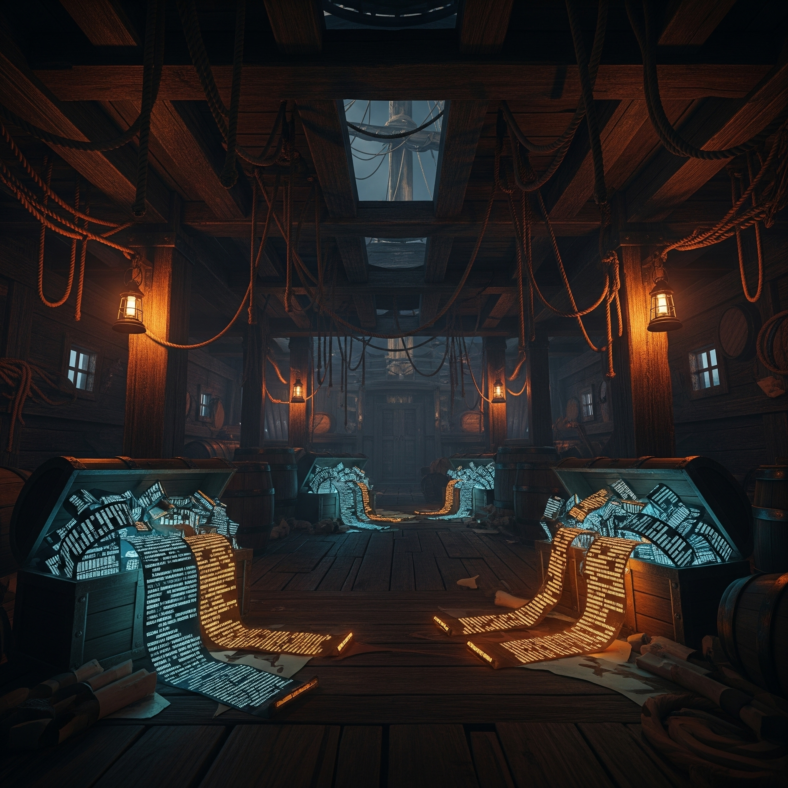

[](https://docs.rs/cargo-hold) [](https://crates.io/crates/cargo-hold) [](https://github.com/Ellipsis-labs/cargo-hold/actions/workflows/build.yaml)

# ⚓ cargo-hold 🏴‍☠️

<div align="center">
  
</div>

A rust-resistant nautical CI tool ⛵ to ensure Cargo's incremental compilation
stays shipshape by keeping your timestamps from drifting off course. No more
rebuilding when the winds haven't changed! 🌊

Cargo-hold is designed to be used as a CLI tool, but you can also use it as a
library if you prefer.

## Overview

`cargo-hold` solves a critical problem in Rust CI/CD pipelines where Cargo's
incremental compilation can be scuttled by unreliable filesystem timestamps.
Like a seasoned navigator reading the stars, it uses content-based change
detection (blake3 + file sizes) and monotonic timestamp generation to chart a
true course, ensuring your builds stay on course while preserving the wind in
your incremental compilation sails.

Each time you run `cargo hold anchor`, it will save the current state of your
source tree to a metadata file in the `target/` dir, which you then save to your
caches. When you run `cargo hold heave`, it will clean up old artifacts to
reclaim disk space while preserving important files.

You can run `cargo hold voyage` to run both `anchor` and `heave` in one command,
which is useful for CI pipelines. It's recommended that you run `cargo hold
voyage` _before_ you execute the build in your CI pipeline, and _after_ you
restore the caches.

## The Problem: Treacherous Waters Ahead! ⛈️

Cargo uses timestamps to determine if a file has changed. This is a problem
because timestamps are not reliable, and when we cloned a git repository, the
timestamps are not preserved. Thus, Cargo will always rebuild the entire
project, even if only a few files have changed - like a rusty anchor dragging
you down, forcing unnecessary work.

We can try restoring the
timestamps based on the Git history, but this is a bad approach because Git's
history is not linear, and you get into a lot of edge cases especially when you
have a large number of commits on different branches.

## The Solution: Chart a True Course! 🗺️

`cargo-hold` is your trusty quartermaster, keeping the ship's log of your files'
timestamps in perfect order. Like a well-maintained ship's manifest, it tracks
the state of your cargo (source files) in the hold.

When you run `cargo-hold anchor`, it drops anchor and takes a careful inventory of your
cargo. When you run `cargo-hold salvage`, it salvages the timestamps like recovering
treasure from the deep. This keeps your manifest and cargo in perfect harmony, ensuring
smooth sailing with Cargo's artifact caching.

## Installation

```bash
# If you have cargo-binstall installed, fetch a precompiled binary:
cargo binstall cargo-hold

# Otherwise, you can compile and install it from crates.io:
cargo install cargo-hold
```

## Usage

### As a Cargo Subcommand

Once installed, `cargo-hold` can be invoked through Cargo:

```bash
# Main command - anchor your build state ⚓
cargo hold anchor

# Individual commands
cargo hold salvage  # 🏴‍☠️ Salvage file timestamps from the ship's log
cargo hold stow     # 📦 Stow files in the cargo hold (update manifest)
cargo hold bilge    # 🚿 Bilge out the metadata file (clear the decks!)
```

### CI Integration

In your CI pipeline, run `cargo hold anchor` before building:

```yaml
# Example GitHub Actions workflow
jobs:
  build: # or check, or test, etc.
    runs-on: ${{ matrix.os }}
    strategy:
      matrix:
        os: [ubuntu-latest, macos-latest]
    steps:
      - uses: actions/checkout@v4
      - uses: actions/cache@v4
        name: Cache Cargo registry
        id: cache-cargo-registry
        with:
          key: cargo-registry-${{ runner.os }}-${{ runner.arch }}-${{ hashFiles('Cargo.lock') }}
          restore-keys: |
            cargo-registry-${{ runner.os }}-${{ runner.arch }}-
          path: |
            ~/.cargo/registry/index/
            ~/.cargo/registry/cache/
            ~/.cargo/git/db/
      - uses: actions/cache@v4
        name: Cache Cargo target
        id: cache-cargo-target
        with:
          key: cargo-target-${{ runner.os }}-${{ runner.arch }}-${{ hashFiles('Cargo.lock') }}
          restore-keys: |
            cargo-target-${{ runner.os }}-${{ runner.arch }}-
          path: |
            target/**
      - name: Install cargo-binstall
        uses: cargo-bins/cargo-binstall@main
      - name: Install cargo-hold
        run: cargo binstall cargo-hold --no-confirm
        # We run cargo hold after restoring the cache, and before running the
        # build.
      - name: Run cargo hold voyage
        run: cargo hold voyage
      - name: Build # or check, or test, etc.
        run: cargo build --release
```

For a real world example, have a look at
[`build.yaml`](.github/workflows/build.yaml) in this repository.

## How It Works: The Ship's Inner Workings ⚙️

1. **Content-Based Change Detection**: Like a keen-eyed lookout, uses BLAKE3 hashing to spot actual changes, not just timestamp drift
2. **Monotonic Timestamps**: Ensures timestamps only sail forward in time, preventing temporal mutinies
3. **Zero-Copy Deserialization**: Uses rkyv to load the ship's manifest faster than you can say "ahoy!"
4. **Parallel Processing**: All hands on deck! Leverages rayon for multi-threaded file hashing

## Ship's Log Location 📜

The ship's log (metadata) is stored at `target/cargo-hold.metadata` within your project's hold. This location ensures:

- Project isolation
- Automatic cleanup with `cargo clean`, or simply by deleting the `target/` directory
- Consistency with Cargo conventions

Note: This manifest contains metadata about your precious cargo (paths, sizes, hashes, timestamps), not the actual build artifacts themselves.

## ⚓ Command Reference 🧭

### Global Options

- `--target-dir <PATH>`: Path to the target directory (default: `target`)
- `--metadata-path <PATH>`: Custom metadata file location (default: `<target-dir>/cargo-hold.metadata`)
- `-v, --verbose`: Increase verbosity (can be used multiple times)
- `-q, --quiet`: Suppress all output except errors

### Environment Variables 🌊

All options can also be configured using environment variables with the `CARGO_HOLD_` prefix. This is particularly useful in CI environments.

Example:

```bash
# Configure via environment
export CARGO_HOLD_MAX_TARGET_SIZE=5G
export CARGO_HOLD_AGE_THRESHOLD_DAYS=14
export CARGO_HOLD_PRESERVE_CARGO_BINARIES=cargo-nextest,cargo-llvm-cov

# Run commands - they'll use the env vars
cargo hold anchor # drop anchor and save the current state of your cargo
cargo hold heave # run the garbage collector
# or
cargo hold voyage # run the anchor and heave commands in one go

cargo build # build your project
```

### Commands

#### `cargo hold anchor` ⚓

**The main command that drops anchor and secures your build state**

This is the recommended CI command that performs the complete workflow. Like a skilled captain, it:

1. **Salvages timestamps** from the previous voyage's log (metadata file)
2. **Scans for changes** by computing BLAKE3 hashes of all Git-tracked files
3. **Updates the manifest** with the current state for future voyages

**How it works:**

- Restores original timestamps for unchanged files (preserving incremental compilation)
- Applies new monotonic timestamps to modified/new files (ensuring proper rebuilds)
- Saves the updated state to enable future timestamp restoration

**When to use:** Run this before `cargo build` in your CI pipeline to ensure incremental compilation works correctly with cached artifacts.

```bash
# In your CI pipeline:
cargo hold anchor
cargo build --release
```

#### `cargo hold salvage` 🏴‍☠️

**Salvages file timestamps from the metadata to restore incremental compilation**

Like diving for sunken treasure, this command restores timestamps intelligently:

- **Unchanged files:** Restored to their original timestamps from the metadata
- **Modified files:** Given a new monotonic timestamp (newer than any existing)
- **New files:** Also receive the new monotonic timestamp

**Technical details:**

- Uses BLAKE3 hashes to detect actual content changes (not just timestamp drift)
- Generates monotonic timestamps to ensure deterministic ordering
- Only updates timestamps for files that need it, minimizing filesystem operations

**When to use:** This is typically called as part of `anchor`, but can be used standalone for debugging or custom workflows.

#### `cargo hold stow` 📦

**Stows files in the cargo hold by saving their current state**

This command takes a complete inventory of your project:

- **Scans all Git-tracked files** (respects .gitignore)
- **Computes BLAKE3 hashes** for content-based change detection
- **Records metadata:** file paths, sizes, hashes, and timestamps
- **Saves to manifest:** Stores everything in `target/cargo-hold.metadata`

**Technical details:**

- Uses parallel processing with rayon for fast hashing
- Memory-efficient streaming for large files
- Zero-copy serialization with rkyv for fast saves

**When to use:**

- After a successful build to update the metadata
- When establishing a new baseline state
- As part of `anchor` (which calls this automatically)

#### `cargo hold bilge` 🚿

**Bilges out the metadata file for a fresh start**

Clears the ship's log by removing the metadata file entirely. This forces cargo-hold to start fresh on the next run.

**When to use:**

- **Troubleshooting:** When experiencing incremental compilation issues
- **Version conflicts:** After cargo-hold updates that change the metadata format
- **Clean slate:** When you want to reset all timestamp tracking
- **Corrupted metadata:** If the metadata file becomes corrupted

**What happens next:** The next `anchor` or `stow` command will create a new metadata file from scratch.

#### `cargo hold heave` ⚓

**Heave ho! Performs garbage collection on build artifacts**

Cleans up old build artifacts to reclaim disk space while preserving important files:

**Options:**

- `--max-target-size <SIZE>`: Target size limit (e.g., "5G", "500M", "1024K", or bytes)
- `--dry-run`: Preview what would be deleted without actually deleting
- `--debug`: Show detailed information during cleanup
- `--preserve-cargo-binaries <NAMES>`: Additional binaries to keep in ~/.cargo/bin
- `--age-threshold-days <DAYS>`: Age threshold for artifact removal (default: 7)

**Cleanup strategy:**

The garbage collector applies both size and age limits together:

1. **Size enforcement:** If a size limit is specified and the target directory exceeds it, removes oldest artifacts first until under the limit
2. **Age cleanup:** After ensuring size compliance, removes any remaining artifacts older than the age threshold (default: 7 days)
3. **Combined approach:** Both conditions are always evaluated - size limit first, then age threshold

**Key behaviors:**

- **Removes by crate:** All related files (rlib, rmeta, fingerprint) together
- **Always preserves:** Binaries, Cargo.toml, lock files, and recent artifacts
- **Preserves previous build artifacts:** Artifacts from the most recent build are never deleted, ensuring optimal cache hit rates in CI
- **Deterministic:** Artifacts are processed oldest-first for predictable results

**Cache-aware cleanup:**

cargo-hold tracks the timestamp of the previous build and ensures those artifacts are preserved during garbage collection. This prevents the common CI problem where freshly built artifacts are immediately deleted because the cache exceeds size limits, which would force unnecessary rebuilds on the next run.

- The `stow` command records the maximum timestamp from the current build
- The `heave` command uses this timestamp to protect artifacts from the previous build
- Even if your cache exceeds the configured size limit after a build, the most recent artifacts remain safe
- This significantly improves cache effectiveness in CI environments

**Also cleans:**

- `~/.cargo/registry/cache`: Old downloaded crates
- `~/.cargo/git/checkouts`: Old git dependencies
- `target/doc`, `target/tmp`, `target/package`: Miscellaneous directories

**Examples:**

```bash
# Keep target directory under 5GB
cargo hold heave --max-target-size 5G

# Preview cleanup without deleting
cargo hold heave --max-target-size 2G --dry-run

# Remove artifacts older than 7 days (default)
cargo hold heave

# Remove artifacts older than 14 days
cargo hold heave --age-threshold-days 14

# Preserve specific tools during cleanup
cargo hold heave --preserve-cargo-binaries cargo-nextest,cargo-llvm-cov
```

#### `cargo hold voyage` 🚢

**Full voyage - combines anchor and heave for complete CI workflow**

This all-in-one command is perfect for CI pipelines that need both timestamp management and disk space control:

1. **First runs `anchor`:** Restores timestamps and updates metadata
2. **Then runs `heave`:** Cleans up old artifacts based on your settings

**Options:**

- `--max-target-size <SIZE>`: Maximum target directory size for garbage collection
- `--gc-dry-run`: Preview what would be cleaned without deleting (GC only)
- `--gc-debug`: Show detailed debug output during garbage collection
- `--preserve-cargo-binaries <NAMES>`: Additional binaries to preserve in ~/.cargo/bin
- `--gc-age-threshold-days <DAYS>`: Age threshold for garbage collection (default: 7)

**Perfect for CI because:**

- Single command for complete workflow
- Ensures incremental compilation works correctly
- Manages disk space automatically
- Reduces CI complexity and maintenance

**Examples:**

```bash
# Complete CI command with 5GB limit
cargo hold voyage --max-target-size 5G

# Preview cleanup while still doing timestamp management
cargo hold voyage --max-target-size 2G --gc-dry-run

# Preserve specific tools during cleanup
cargo hold voyage --preserve-cargo-binaries cargo-nextest,cargo-llvm-cov

# Use a 14-day age threshold instead of default 7
cargo hold voyage --gc-age-threshold-days 14
```

## Performance

`cargo-hold` is built for speed, like a sleek clipper ship with a rust-proof hull:

- Memory-mapped file I/O - faster than a sailor up the rigging
- Parallel BLAKE3 hashing with rayon - all hands working together
- Zero-copy manifest loading with rkyv - no time wasted at port
- Typical overhead: <100ms for most projects - barely a ripple in your voyage
- Built with Rust - naturally rust-resistant! ⚙️🦀

## Comparison with other tools (excluding nightly-only tools/features)

- [Swatinem/rust-cache](https://github.com/Swatinem/rust-cache) - handles saving/restoring of caches using GitHub's cache action. Does some cleanup of old artifacts, but doesn't do any timestamp management. If you use this "out of the box", you will still have the problem of constantly rebuilding your project.
- [cargo-sweep](https://github.com/rust-lang/cargo-sweep) - cargo-sweep only deletes old artifacts, and doesn't do any timestamp management.
- [`cargo clean`](https://doc.rust-lang.org/cargo/commands/cargo-clean.html) - cargo clean simply deletes the target directory, and doesn't do any timestamp management.

## License

Licensed under the MIT license ([LICENSE](LICENSE) or <http://opensource.org/licenses/MIT>)

## Contributing

Contributions are welcome! All hands on deck! Please feel free to submit a Pull
Request and join our crew. 🦜 Whether you're a seasoned sailor or a fresh crab,
we promise this codebase won't rust on your watch! 🦀
